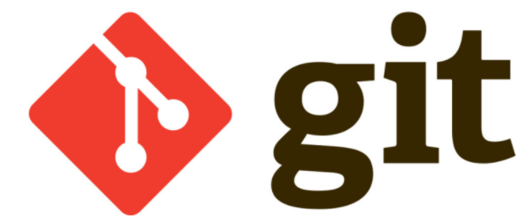
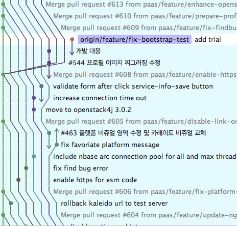
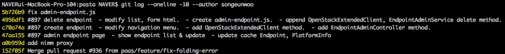
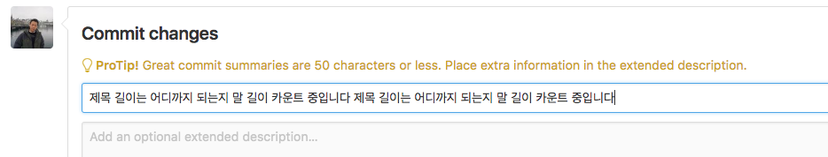
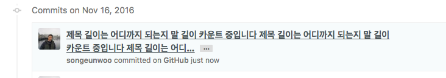
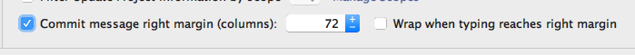
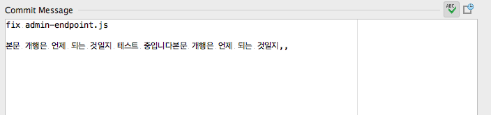

# git commit message convention



## 좋은 커밋 메세지는 왜 중요한가?

    모든 일을 혼자 진행하는 개발자라면 이 글을 무시해도 상관 없다.
    하지만 다른 개발자들과 협력을 하는 개발자라면 반드시 이 내용을 숙지하여야 할것이다.
    아래와 같이 보통 각각의 프로젝트에는 수많은 히스토리들이 존재한다.
    



    동료 개발자들과의 (또는 미래의 나 자신) 협력에서 diff를 확인 하지 않고도, 
    직관적으로 변경사항에 대한 맥락을 공유 할수 있는 최고의 수단은 
    잘 다듬어진 커밋 메세지 이다.
    커밋 메세지 만으로도 어떤 개발자가 좋은 협력자인지 알수 있는 것이다.  

## 훌륭한 Git 커밋 메시지의 일곱 가지 규칙

### 1. 제목과 본문을 빈 행으로 분리한다


 
    git log --oneline, git shortlog 
    위와 같은 명령어는 제목행과 본문 사이 빈 행이 존재해야 제대로 동작 한다.
    자세한 내용인지 보고 싶다면 git show, git diff, git log -p 같은 명령을 사용하면 된다.

### 2. 제목 행을 50자로 제한한다

    간결하게 적는 방법이다.
    참고로 GitHub UI 에서는 50자 이상 입력하면 경고 표시가 나오고, 69자 이상은 말 줄임으로 나타난다.




### 3. 제목 행 첫 글자는 대문자로 쓴다

     말 그대로 제목에서 첫 글자는 대문자로 시작한다는 규칙이다.

### 4. 제목 행 끝에 마침표를 넣지 않는다

    제목행의 50자 규칙을 따르기 위해 마침표같은 사소한 공간도 아끼자는 의미이다.

### 5. 제목 행에 명령문을 사용한다

    여기서 명령문 이란 "명령이나 설명하듯 말하는 것"을 의미한다.
    
```
* Fix admin-endpoint.js 
* Add google analytics
* Merge pull request #967 from paas/feature/endpoint

* (If applied, this commit will) Fix admin-endpoint.js 
* (If applied, this commit will) Add google analytics
* (If applied, this commit will) Merge pull request #967 from paas/feature/endpoint
```

    위와 같이 해당 커밋이 적용 되었을때 자연스럽게 문장으로써 연결이 된다면 적절한 커밋 제목 이다.
    참고로 커밋 메시지는 과거형으로 적지 말자. Fixed 대신 Fix, Added 대신 Add.

### 6. 본문을 72자 단위로 개행한다

    이 규칙은 Git은 본문을 절대 자동으로 개행해 주지 않는다.
    72자로 기준을 잡은 이유는 Git 들여쓰기 문자를 위한 여유공간 확보를 위해서 이다.
    Intellij IDEA를 사용하는 우리로써는 상당히 편리 하다.




### 7. 어떻게 보다는 무엇과 왜를 설명한다

    가장 중요한 내용이 아닐까 생각 된다.
    우리들은 대부분 어떻게 수정을 하였다 라고 작성을 할것이다.
    코드 설명 보다는 당신이 왜이렇게 바꾸었는지 (무엇이 잘못 동작을 하였는지)
    지금은 어떻게 동작 하는지, 왜 바꾸기로 헀는지에 대해서 작성하기를 바란다.

    제목 줄에 무엇을 추가했는지 적었고 더 이상 설명할 필요가 없어도 해당 커밋이 무엇을 의미하는지, 
    어떤 역할을 할 수 있는지에 대해 추가로 기술을 한다면,
    미래의 나와 함께 협업하는 개발자들이 당신을 달리 볼것이다.


## 마치며

이제 앞으로는
게으른 커밋 메시지, “여러가지 고치고 정리했음” 또는 
하나의 패치 안에 두 가지 변경. “이거를 수정했고 모든 key를 named으로 수정했음”과 같은 커밋이 없길 바라며,
우리 모두 행복한 개발자가 되었으면 한다.