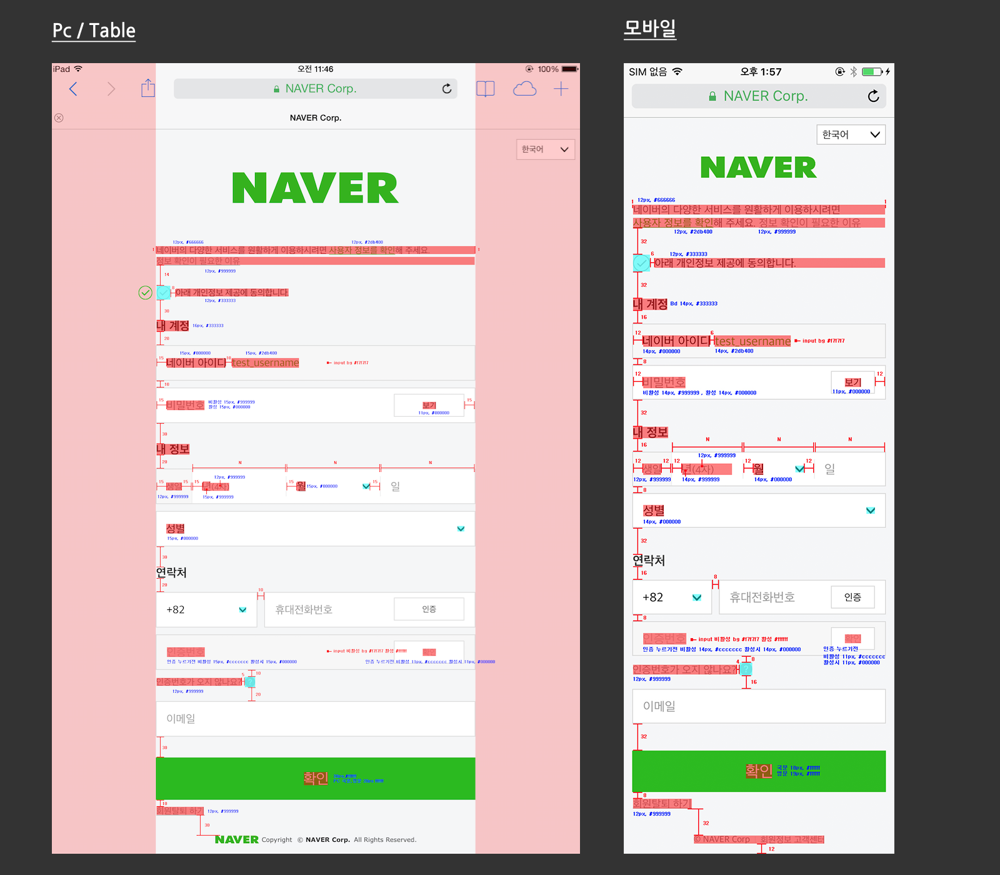
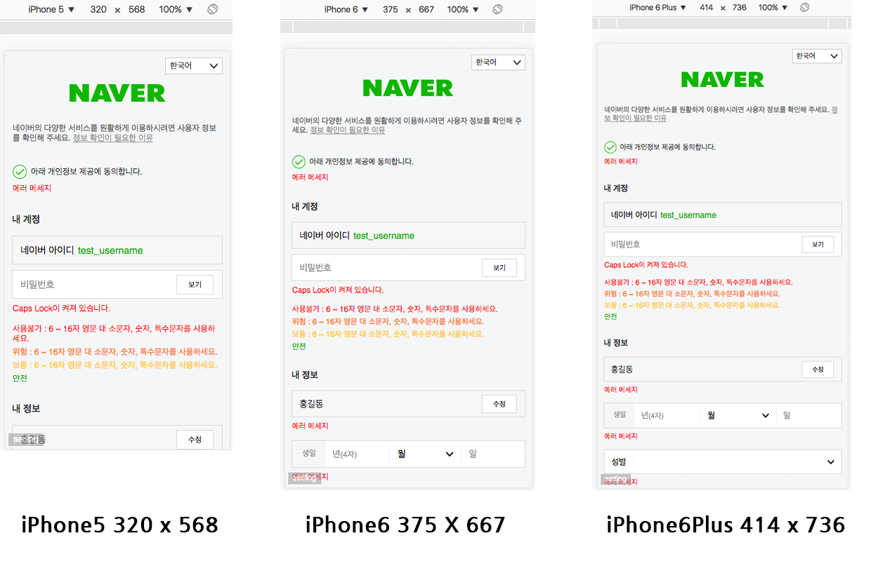
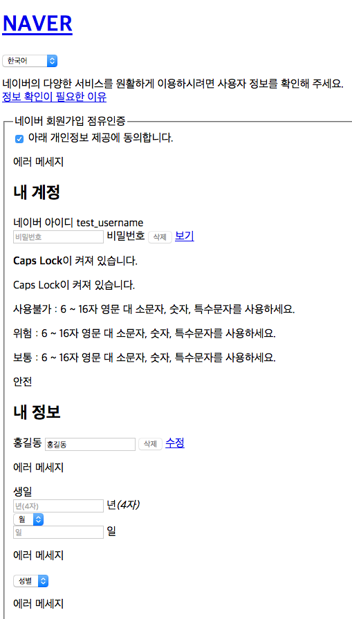
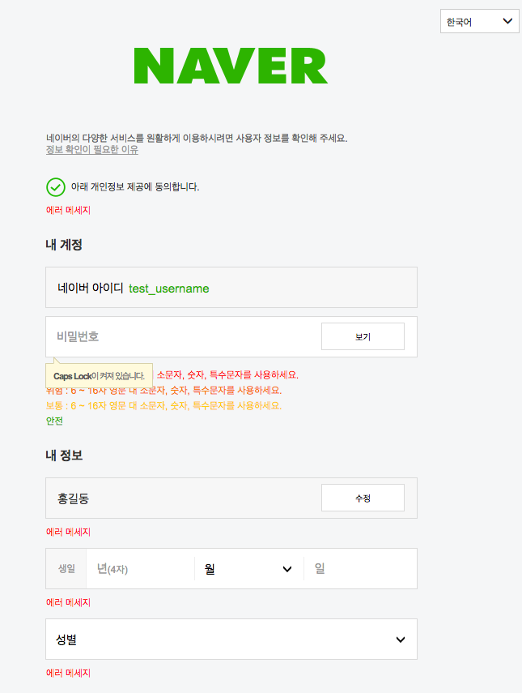
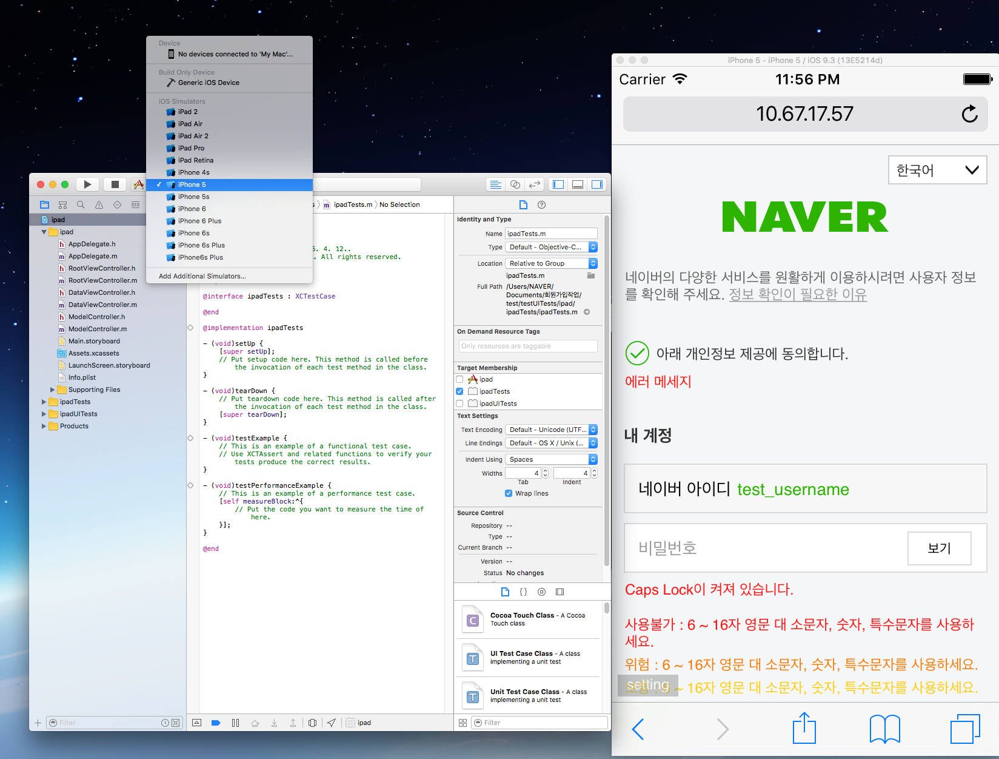

# 마크업이 전달되는 과정 소개하기

    이번 스터디를 통해서 마크업 개발이 어떻게 진행되는지 간략하게 살펴보는 시간을 갖도록 하겠습니다.

## 네이버 '회원서비스' 업무 프로세스

1. 신규업무 발생
2. 기획문서 공유
3. 주간 회의때 논의
4. 디자인 시안 작업 진행 (기획서를 바탕으로 작업된 디자인 시안을 jpg or png 파일형식으로 공유)
5. 디자인 시안 컨폼 - >완료
6. 컨폼이 완료된 디자인 시안의 가이드 파일이 전달 (디자인 요소별 px,font,color 수치값 적용된 PSD 파일형식으로 공유)
7. 마크업 가이드 작업 진행 (html,css 작업 후 git 저장소에 push)
8. 마크업 가이드 1차 디자인 검수 요청 -> 검수 완료
9. 검수가 완료된 마크업 가이드 페이지 git lab을 통해 DIFF url 개발파트 전달
10. 개발 작업진행 -> 개발 완룐
11. QA 진행 -> QA 완료
12. 배포

## 예시 ) 회원 서비스 중 회원가입의 전환 페이지
- url :<br>
    http://gitlab2.uit.nhncorp.com/nid/naverid/issues/11<br>
    http://view.gitlab2.uit.nhncorp.com/nid/naverid/raw/feature/global-login/src/join/desktop/01_global_certification.html
- 기존 pc/table & mobile 두벌의 마크업 파일로 전달
- 반응형 웹 적용 (pc/ tablet/ mobile) 하나의 마크업 파일로 전달

## 마크업 개발이 진행되는 과정 소개

 ### 디자인 가이드 전달
 

 ### 마크업 가이드 진행
1. 시맨틱한 마크업 구조 설계 (HTML 문서 작성) :<br>
 HTML태그를 통해서 정보를 구조화한다. 디자인이 적용되지 않은 상태이며, 가장 기초적인 골격의 형태로 내용의 선형성을 유지하고 의미론적으로 작성되며 접근성이 확보될 수 있도록 작성되어야 한다.

    -DTD(Document type definition) 선언

    ``` html
    <!DOCTYPE html>
    ```

    -주언어 lang="" 속성 명시

    ``` html
    <html lang="ko">
    ```     

    -head 태그 안에는 문서의 제목, 스타일 시트 링크, 문서의일반적 정보(metadata) 제공

    ``` html
    <html lang="ko">
    <head>
    	<meta charset="UTF-8">
    	<meta name="viewport" content="width=device-width, initial-scale=1.0, maximum-scale=1.0, minimum-scale=1.0, user-scalable=no">
    	<meta http-equiv="X-UA-Compatible" content="IE=edge">
    	<title>네이버 회원정보</title>
    	<link rel="stylesheet" href="css/join_global.css">
    	<script type="text/javascript" src="http://code.jquery.com/jquery-latest.js"></script>
    </head>
    <body>
      <!-- 콘텐츠 영역 -->
    </body>Â
    </html>
    ```       
     ** 뷰포트(Viewport)란?<br>
  웹 페이지가 표시되는 영역으로<br>
  뷰포트 메타태그를 이용하면 모바일 웹에 최적의 상태로 화면이 표시되도록 설정할 수 있다.


   <br><br>
   


  -body 태그 안에는  HTML 문서의 내용을 담는다.
  ``` html
  <body>
<!-- tg-display=>{"기본": []} -->
<!-- tg-display -->
  <div id="wrap">
  	<div id="header">
  		<h1><a href="#" class="sp_global h_logo">NAVER</a></h1>
  		<div class="lang">
  			<select id="" title="language" tabindex="2" class="sl_box sp_global">
  				<option>한국어</option>
  				<option>English</option>
  				<option>中文(简体)</option>
  				<option>中文(台灣)</option>
  			</select>
  		</div>
  	</div>
  	<div id="container">
  		<div class="content">
  			<div class="info_text">
  				<!-- tg-text=info_text -->
  				<p>네이버의 다양한 서비스를 원활하게 이용하시려면 사용자 정보를 확인해 주세요.<br> <a href="#" class="check_link">정보 확인이 필요한 이유</a></p>
  			</div>
  			<form>
  				<fieldset>
  					<!-- tg-text=form_legend -->
  					<legend>네이버 회원가입 점유인증</legend>
  					<div class="check_info">
  						<span class="input_check_big">
  							<!-- [D]로그인상태 checked일때 label에 클래스 on추가해주세요. 예)class="on" -->
  							<input type="checkbox" id="login_chk" class="chk" checked="">
  							<!-- tg-text=login_chk -->
  							<label for="login_chk" class="on"><span>아래 개인정보 제공에 동의합니다</span></label>
  						</span>
  					</div>
  					<!-- tg-display=>{"에러메세지": []} -->
  					<!-- tg-text=warning_text -->
  					<p class="warning_text">에러메세지</p>
  					<!-- tg-display -->

  					<!-- tg-text=h2_01 -->
  					<h2 class="title">내 계정</h2>
  					<div class="section">
  						<div class="disable_wrap">
  							<!-- tg-text=form_id -->
  							<span class="disable_label">네이버 아이디</span>
  							<span class="disable_id">test_username</span>
  						</div>
  						<!-- [D] : 입력창에 focus 될경우 class="input_wrap"에 .input_wrap_focus 클래스 추가 해주세요. -->
  						<div class="input_wrap inner_wrap">
  							<!-- tg-attribute={"placeholder": "form_pw"} -->
  							<input type="password" placeholder="비밀번호" id="form_pw">
  							<!-- tg-text=lb_form_pw-->
  							<label for="form_pw">비밀번호</label>
  							<!-- tg-text=button_delete -->
  							<button type="button" disabled="" title="delete" class="sp_global btn_delete">delete</button>
  							<!-- tg-text=btn_view-->
  							<a href="#" class="inner_button">보기</a>
  						</div>

  						<div class="warning_wrap" style="display:block">
  							<div class="capslock_wrap">
  								<!--[D] pc에서 에러메세지 툴팁 형태로 노출 -->
  								<p class="warning_tooltip">
  									<!-- tg-text=tooltip_content-->
  									<span class="tooltip_text"><strong>Caps Lock</strong>이 켜져 있습니다.</span>
  									<span class="sp_global tooltip_point"></span>
  								</p>
  								<!-- [D] 모바일/tablet에서 Caps Lock 노출 -->
  								<!-- tg-text=Caps Lock-->
  								<p class="capslock_text">Caps Lock이 켜져 있습니다.</p>
  							</div>
  							<!-- [D] 모바일/tablet에서 에러 메세지 노출 -->
  							<div class="warning_message">
  								<!-- [D] 기본 상태 표시는 사용불가이며 위험,보통,안전 상태에 따라 각각의 클래스를 추가해 주세요. -->
  								<!-- tg-text=state_text-->
  								<p class="state_text">사용불가 : 6 ~ 16자 영문 대 소문자, 숫자, 특수문자를 사용하세요.</p>
  								<!--[D] 위험 : class="state_danger", 보통 : class="state_usually", 안전 : class="state_safety" 클래스 Add해 주세요-->
  								<!-- tg-text=state_danger-->
  								<p class="state_text state_danger">위험 : 6 ~ 16자 영문 대 소문자, 숫자, 특수문자를 사용하세요.</p>
  								<!-- tg-text=state_usually-->
  								<p class="state_text state_usually">보통 : 6 ~ 16자 영문 대 소문자, 숫자, 특수문자를 사용하세요.</p>
  								<!-- tg-text=state_safety-->
  								<p class="state_text state_safety">안전</p>
  							</div>
  						</div>
  					</div>
  			      <!-- 코드 생략 -->
  				</fieldset>
  			</form>
  		</div>
  	</div>
  	<div id="footer">
  		<address>
  			<a href="#" class="sp_global logo"><span class="blind">naver</span></a><em class="copy">Copyright</em><em class="u_cra_simbol">&copy;</em><a href="#" class="u_cra">NAVER Corp.</a><span class="bar">|</span><a href="#" class="u_cri">Help</a><span class="all_r">All Rights Reserved.</span>
  		</address>
  	</div>
  </div>
</body>
```  
<br><br>

- 스타일 시트 설계 (CSS 문서 작성) : <br>
HTML 문서위에 css로 스타일링 하여 디자인 시안과 동일한 UI로 화면을 구성한다.
<br><br>

- 테스트 및 유효성 검사 :<br>
 HTML과 css에 대한 문법적 검사로 페이지 단위로 이루어진다.<br>
 HTML W3c validator & firfox의 부가기능 firebug ot firebug 로 검사<br>
 W3c validator : https://validator.w3.org/

- 웹접근성 테스트 n-wax 등등 테스트 : <br>
n-wax : http://nuli.navercorp.com/sharing/fe/nwax

- 검수 기준 브라우져, 모바일 기기에서 마크업 가이드의 화면과 디자인 가이드에 표기된 수치와 동일하게 노출되는지 테스트한다.

ex ) pc :  IE8 ~ IE11 (디자인 검수 브라우져 window IE 11)<br>
           mobile : iPhone 5  (inspector or X코드 )<br>
  -x-code<br>
  <br><br>         
