# 초딩도 하는 성능 테스트

 >이번 시간을 통해 오픈소스인 nGrinder에 대해 알아보고,
  사용하는 방법을 알아 보도록 하자.

## 부하테스트? 그건 테스터 분들이 하는거 아닌가?

  개발자는 코딩만 해주면 되는 것일까? 내 생각은 '아니다' 입니다.
  구글에서는 어떻게 하는지 찾아 보았습니다.

  구글은 테스터가 아닌 각 제품 개발팀이 제품 품질에 대해 책임을 집니다.
  모든 개발자는 자기 자신의 테스트를 수행해야 하며,
  테스터의 임무는 독자적인 테스트가 수행 가능하도록 자동화 인프라와 프로세스를 가능케 하는 것이라고 합니다.
  이런 전략은 개발자와 테스터가 동등한 입장이 되게 하고,
  품질 관점에서 진정한 파트너가 되게 하며, 개발자에 가장 큰 품질책임을 부여한다고 되어 있습니다.

[원본 글](http://googletesting.blogspot.kr/2011/01/how-google-tests-software.html?utm_source=feedburner&utm_medium=feed&utm_campaign=Feed:+blogspot/RLXA+(Google+Testing+Blog)

## 많고 많은 성능 테스트중에 nGrinder인 이유는?

 * 오픈소스로 무료니까!
 * 대용량 분산 테스트가 가능 하니까!! (jmeter)
 * 초딩도 할수 있을만큼 간단 하니까!!!
    - 한글, 영어, 중국어 지원
    - 간단한 UI

## 아키텍처

성능 테스트 방법
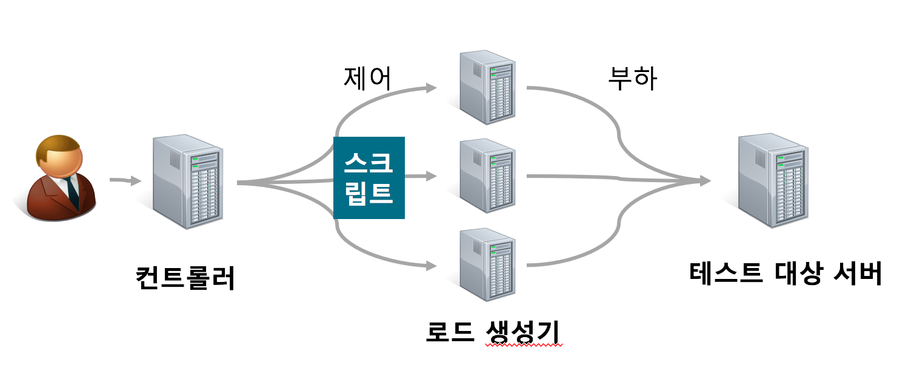

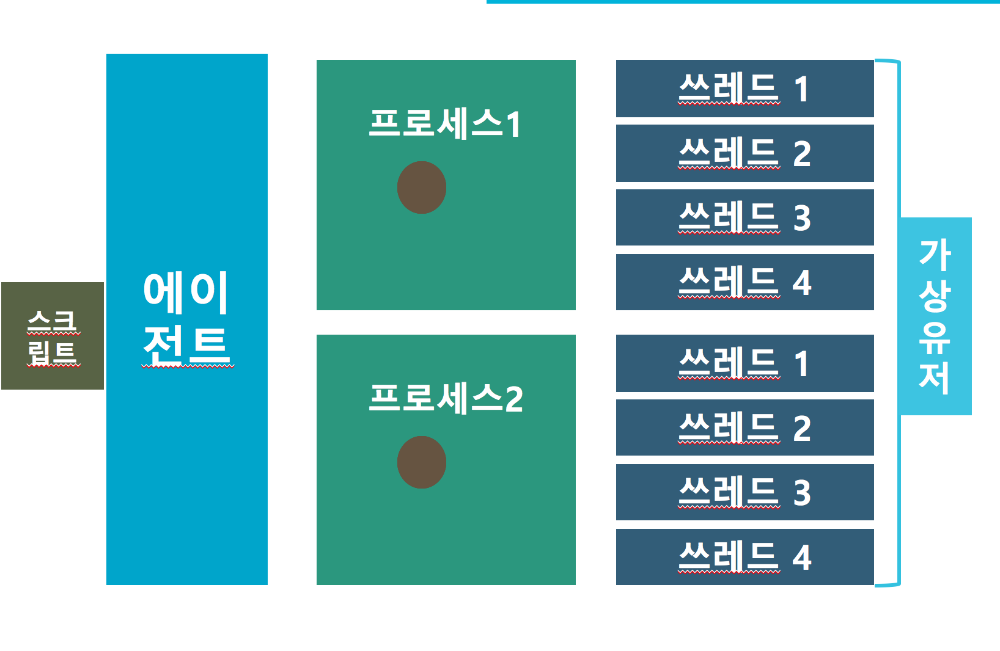


전체적인 로드맵
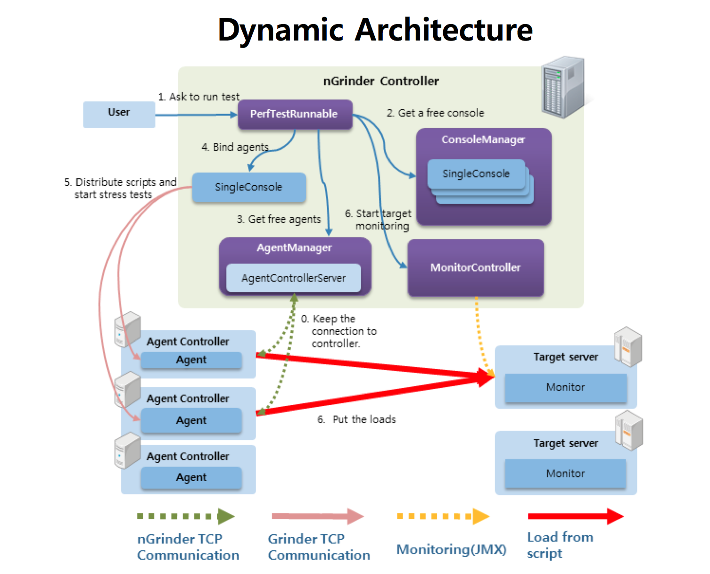
[출처](http://junoyoon.tistory.com/)

## 설치방법

복잡한 설치방법..?? 이것저것 인스톨? 그런건 필요 없습니다.

다운로드 & 실행

github : https://github.com/naver/ngrinder

docker hub : https://hub.docker.com/r/ngrinder

nGrinder는 SVN Kit, maven, Jetty webserver, groovy, python 과 같은 굉장히 많은 라이브러리를 포함하고 있기 때문에 상당한PermGem memory가 필요합니다.
따라서 다음과 같은 명령으로 실행하길 권장 합니다.

```java

# 기본 실행
java -jar ngrinder-controller-3.4.war

# PermGem memory option
java -XX:MaxPermSize=200m -jar ngrinder-controller-3.4.war

# port option
java -XX:MaxPermSize=200m -jar ngrinder-controller-3.4.war --port 9000 (-p 9000)

```

## nGrinder 가지고 놀아볼까?

테스트 대상
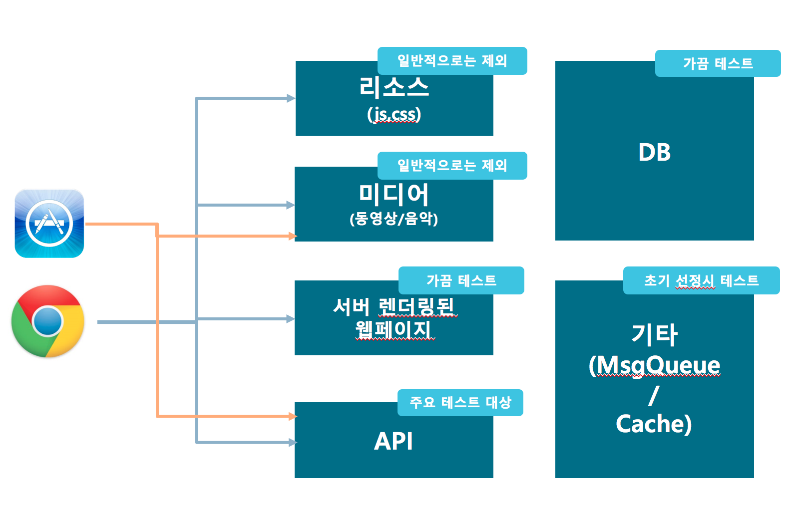

테스트 언어
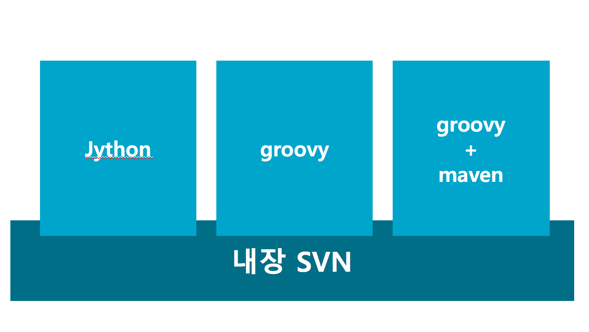


#### groovy

nGrinder Groovy 스크립트내의 클래스에는 JUnit을 nGrinder 에 맞게 처리할 수 있도록 @RunWith(Grinder Runner)를 사용합니다.

@Test로 어노테이션이 붙은 메소드는 쓰레드 내에서 반복 실행됩니다. 이때 일반적인 JUnit Assertion을 사용하여 테스트 결과를 검증할 수 있습니다. Assertion에 실패할 경우 해당 쓰레드에서 실행한 마지막 테스트가 실패 처리됩니다.

nGrinder Groovy 테스트에서는 기존에 많이 쓰이던 JUnit의 @BeforeClass @Before @AfterClass @After 대신에 다음과 같은 어노테이션이 사용됩니다.

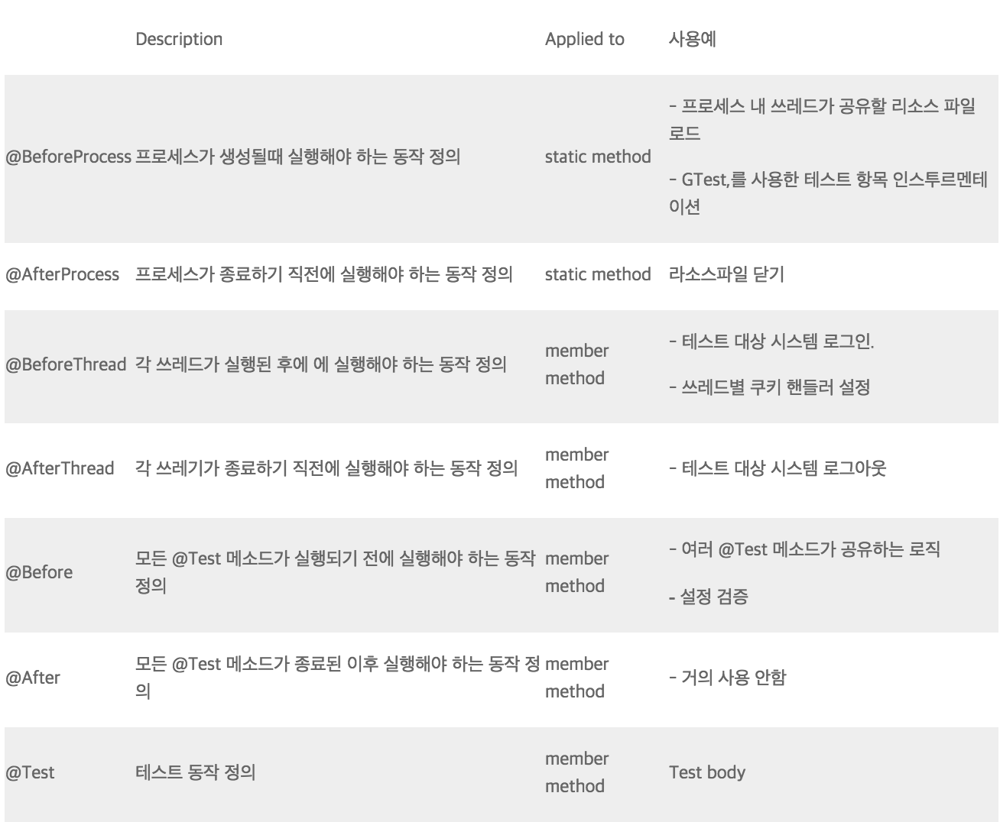
[출처](https://github.com/naver/ngrinder/wiki/Groovy-Script-Structure)

이런 어노테이션을
조합하여 테스트 케이스를 작성하는 경우 다음과 같은 실행 흐름을 갖게 됩니다.
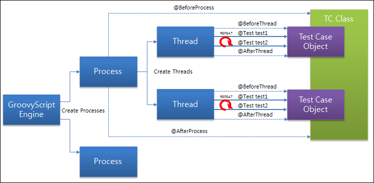
[출처](https://github.com/naver/ngrinder/wiki/Groovy-Script-Structure)

처음 작성하시는 분들을 위해 기본 템플릿을 제공해 드립니다.
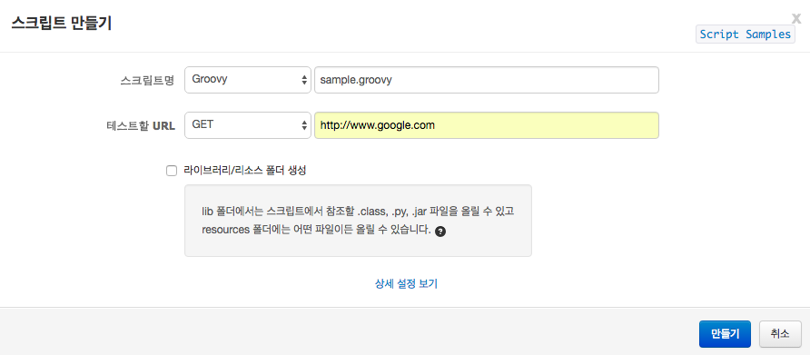

```java

import static net.grinder.script.Grinder.grinder
import static org.junit.Assert.*
import static org.hamcrest.Matchers.*
import net.grinder.plugin.http.HTTPRequest
import net.grinder.plugin.http.HTTPPluginControl
import net.grinder.script.GTest
import net.grinder.script.Grinder
import net.grinder.scriptengine.groovy.junit.GrinderRunner
import net.grinder.scriptengine.groovy.junit.annotation.BeforeProcess
import net.grinder.scriptengine.groovy.junit.annotation.BeforeThread
// import static net.grinder.util.GrinderUtils.* // You can use this if you're using nGrinder after 3.2.3
import org.junit.Before
import org.junit.BeforeClass
import org.junit.Test
import org.junit.runner.RunWith

import java.util.Date
import java.util.List
import java.util.ArrayList

import HTTPClient.Cookie
import HTTPClient.CookieModule
import HTTPClient.HTTPResponse
import HTTPClient.NVPair

/**
 * A simple example using the HTTP plugin that shows the retrieval of a
 * single page via HTTP.
 *
 * This script is automatically generated by ngrinder.
 *
 * @author Geunwoo Son
 */
@RunWith(GrinderRunner)
class TestRunner {

	public static GTest test
	public static HTTPRequest request
	public static NVPair[] headers = []
	public static NVPair[] params = []
	public static Cookie[] cookies = []

	@BeforeProcess
	public static void beforeProcess() {
		HTTPPluginControl.getConnectionDefaults().timeout = 6000
		test = new GTest(1, "www.google.com")
		request = new HTTPRequest()
		grinder.logger.info("before process.");
	}

	@BeforeThread
	public void beforeThread() {
		test.record(this, "test")
		grinder.statistics.delayReports=true;
		grinder.logger.info("before thread.");
	}

	@Before
	public void before() {
		request.setHeaders(headers)
		cookies.each { CookieModule.addCookie(it, HTTPPluginControl.getThreadHTTPClientContext()) }
		grinder.logger.info("before thread. init headers and cookies");
	}

	@Test
	public void test(){
		HTTPResponse result = request.GET("http://www.google.com", params)

		if (result.statusCode == 301 || result.statusCode == 302) {
			grinder.logger.warn("Warning. The response may not be correct. The response code was {}.", result.statusCode);
		} else {
			assertThat(result.statusCode, is(200));
		}
	}
}


```

 그럼 각 템플릿을 뜯어 보도록 하겠습니다.
 먼저 @BeforeProcess 를 작성하는 예입니다.

  ```java
  ....
  public static GTest test;
  public static HTTPRequest request;
  public static GTest test;

  @BeforeProcess
  public static void beforeProcess() {
      test = new GTest(1, "test1");
      request = new HTTPRequest();
      test.record(request);  //레코딩하는 부분
      grinder.logger.info("before process.");
  }
  ....

  ```

   여기는 모든 쓰레드가 공유할 데이터를 정의하기에 좋은 곳입니다. @BeforeProcess 어노테이션이 붙은 static 메소드는 각 테스트 통계를 수집할 때 사용하는 GTest 인스턴스를 정의하고, request 인스턴스를 바이트 코드 조작(record 메소드)을 통해 레코딩하도록 합니다. 이제 request 인스턴스에 대해 메소드 호출을 하게 되면 테스트 별로 TPS를 증가 시킬것 입니다. 만약 여러 HTTPRequest 객체를 레코딩 해야 한다면 해당 객체를 test.record(request2) 와 같이 처리하면 됩니다.


  다음은 @BeforeThread 어노테이션 입니다.

  ```java

    @BeforeThread
    public void beforeThread() {
        grinder.statistics.delayReports=true;
        grinder.logger.info("before thread.");
    }

  ```

  이 메소드는 각 쓰레드가 시작되기 전에 실행되어야 할 부분을 기재합니다. 보통 여기에 로그인 같은 테스트 사전 처리 코드를 넣습니다.그 다음에는 실제 테스트를 작성합니다. 아래 코드와 같이 @Test 이하 코드를 추가해서 여러 test 메소드를 정의 할 수 있습니다.

  ```java

  private boolean googleResult;

  @Test
  public void testGoogle(){
      googleResult = false;
      HTTPResponse result = request.GET("http://www.google.com");
      if (result.statusCode == 301 || result.statusCode == 302) {
          grinder.logger.warn("Warning. The response may not be correct. The response code was {}.", result.statusCode);
      } else {
          assertThat(result.statusCode, is(200));
      }
      googleResult = true;
  }

  @Test
  public void testYahoo(){
      if (!googleResult) {
          grinder.logger.warn("Just return. Because prev google test is failed.");
          return;
      }
      HTTPResponse result = request.GET("http://www.yahoo.com");
      if (result.statusCode == 301 || result.statusCode == 302) {
          grinder.logger.warn("Warning. The response may not be correct. The response code was {}.", result.statusCode);
      } else {
          assertThat(result.statusCode, is(200));
      }
  }

  ```
  위 코드의 경우는 첫번째 testGoogle() 테스트 메소드를 실행하고, 그 뒤에 testYahoo()를 실행합니다. 그런데 googleResult 라는 멤버 변수를 사용하여 testGoogle() 메소드의 실행 결과를 참조합니다. 이런 방식은 원래의 JUnit 에서는 불가능 합니다. JUnit 에서는 각 테스트 별도 각각 별도의 테스트 객체를 생성 합니다. 그러나 GrinderRunner 는 이와 같은 제약을 수정하여, 쓰레드당 한개의 테스트 객체만을 사용합니다. 따라서 googleResult 같은 멤버 변수 참조도 가능해 졌습니다.

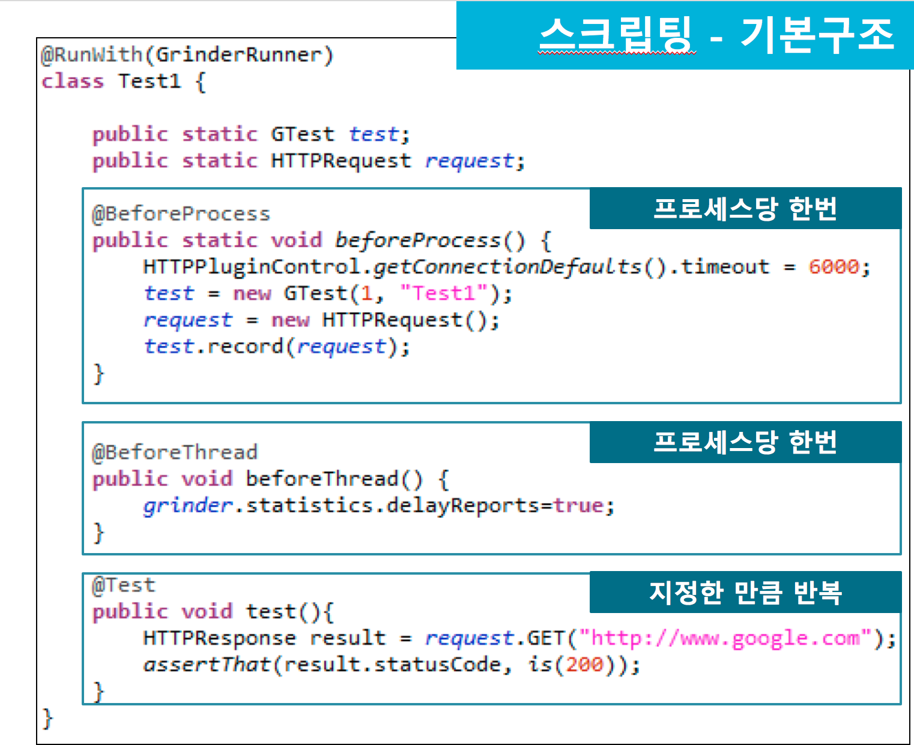

  HTTPRequest객체는 GET/POST/PUT/DELETE 메소드를 지원합니다.
  post 호출하는 방법은 아래와 같이 사용할수 있습니다.   [api](http://grinder.sourceforge.net/g3/script-javadoc/net/grinder/plugin/http/HTTPRequest.html)


  ```java

  @Test
  public void test1(){
    request1.POST("http://www.google.com", [new NVPair("key1","value1"), new NVPair("key2":"value2")] as NVPair[])
  }

  //또는 아래와 같이 사용 가능 합니다.

  @Test
  public void test1(){
      request1.POST("http://www.google.com", nvs(["key1":"value1", "key2":"value2"]))
  }
  // Provide a method to convert map to NVPair array
  def nvs(def map) {
      def nvs = []
      map.each {
          key, value ->  nvs.add(new NVPair(key, value))
      }
      return nvs as NVPair[]
  }

  ```

  간혹 어떤 호출에 대해 엄청난 량의 Response 를 리턴하는 서버를 테스트 해야 할 경우가 있습니다.
  동영상이나 이미지등이 포함된 페이지의 경우 그런데요.
  리턴이 오는 것만을 확인하면 충분한 경우라면 전체 Response를 메모리에 올릴 필요 없이 일부만을 읽어오게 처리할 수 있습니다. 다음 코드 처럼요.

  ```java
  @RunWith(GrinderRunner)
class Test1 {

    public static GTest test;
    public static HTTPRequest request;

    @BeforeProcess
    public static void beforeClass() {
        test = new GTest(1, "aa000000");
        request = new HTTPRequest();
        // Make not to read whole response.
        request.setReadResponseBody(false);
        test.record(request);
        grinder.logger.info("before process.");
    }

    // Prepare buffer
    byte[] buffer = new byte[1000];

    @BeforeThread
    public void beforeThread() {
        grinder.statistics.delayReports=true;
        grinder.logger.info("before thread.");
    }


    @Test
    public void test(){
        HTTPResponse result = request.GET("http://www.google.com");

        // Read only 1000 byte and close the stream
        def stream = result.getInputStream();
        stream.read(buffer);
        stream.close();

        if (result.statusCode == 301 || result.statusCode == 302) {
            grinder.logger.warn("Warning. The response may not be correct. The response code was {}.", result.statusCode);
        } else {
            assertThat(result.statusCode, is(200));
        }
    }

  ```

#### jython

흐름도
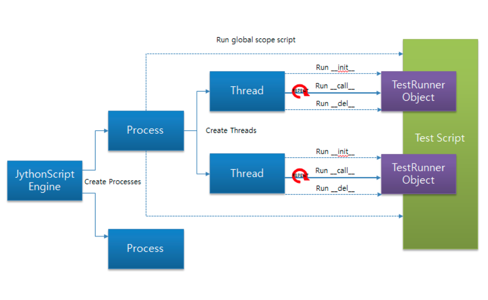

```javascript

# -*- coding:utf-8 -*-

# A simple example using the HTTP plugin that shows the retrieval of a
# single page via HTTP.
#
# This script is automatically generated by ngrinder.
#
# @author Geunwoo Son
from net.grinder.script.Grinder import grinder
from net.grinder.script import Test
from net.grinder.plugin.http import HTTPRequest
from net.grinder.plugin.http import HTTPPluginControl
from java.util import Date
from HTTPClient import NVPair, Cookie, CookieModule

control = HTTPPluginControl.getConnectionDefaults()
control.timeout = 6000

test1 = Test(1, "Test1")
request1 = HTTPRequest()

# Set header datas
headers = [] # Array of NVPair
# Set param datas
params = [] # Array of NVPair
# Set cookie datas
cookies = [] # Array of Cookie

class TestRunner:
	def __init__(self):
		test1.record(TestRunner.__call__)
		grinder.statistics.delayReports=True
		pass

	def before(self):
		request1.headers = headers
		for c in cookies: CookieModule.addCookie(c, HTTPPluginControl.getThreadHTTPClientContext())

	# test method		
	def __call__(self):
		self.before()
		result = request1.GET("http://please_modify_this.com", params)

		if result.getStatusCode() == 200 :
			return
		elif result.getStatusCode() in (301, 302) :
			grinder.logger.warn("Warning. The response may not be correct. The response code was %d." %  result.getStatusCode())
			return
		else :
			raise


```

#### groovy + maven

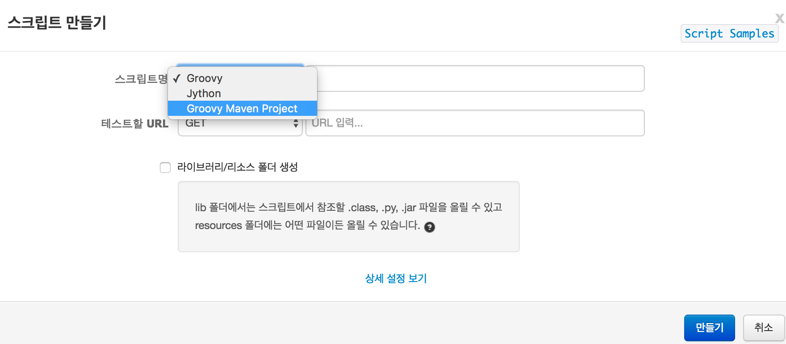

단지 차이점은 지정하신 디렉터리 아래에 메이븐 프로젝트가 생성이 되는 점과,
라이브러리를 pom.xml로 추가가 가능하다는 점입니다.

resourcePath

```java

import org.codehaus.groovy.reflection.ReflectionUtils;
....
 
class YourTest {
    String text;
 
    @BeforeThread
    public void beforeThread() {
       // In groovy, InputStream contains text field.
       text = loadResourceFromClassPath("/resource1.txt").text;
    }
 
    @Test
    public void doTest() {
       ....
    }
 
    // This is groovy way to load resource from classpath
    public loadResourceFromClassPath(String resourcePath) {
        return ReflectionUtils.getCallingClass(0).getResourceAsStream(resourcePath);
    }
}


```
;

스크립트에서 리소스를 참조하고자 할 때, Jython 스크립트나 단순 Groovy 스크립트에서는 open(“./resources/resource1.txt”) 또는 "new File("./resources/resource1.txt")" 과 같이 현재 폴더를 기준으로 하위 폴더를 뒤져 리소스를 로드 하지만, Groovy 메이븐 프로젝트는 다른 방법을 사용하여야 합니다. Groovy 메이븐 프로젝트에서는 IDE에서 Groovy JUnit 테스트를 실행할 때도 리소스가 정상적으로 로딩 될 수 있도록 현재 폴더가 아닌 클래스 패스로부터 리소스를 찾아 로딩할 수 있다는 점이 차이가 있습니다.


## 서버 인터렉션 알아내기 팁!

웹은 일반적으로 브라우저에서 제공 해주는 개발자도구를 사용해서 쉽게 GET
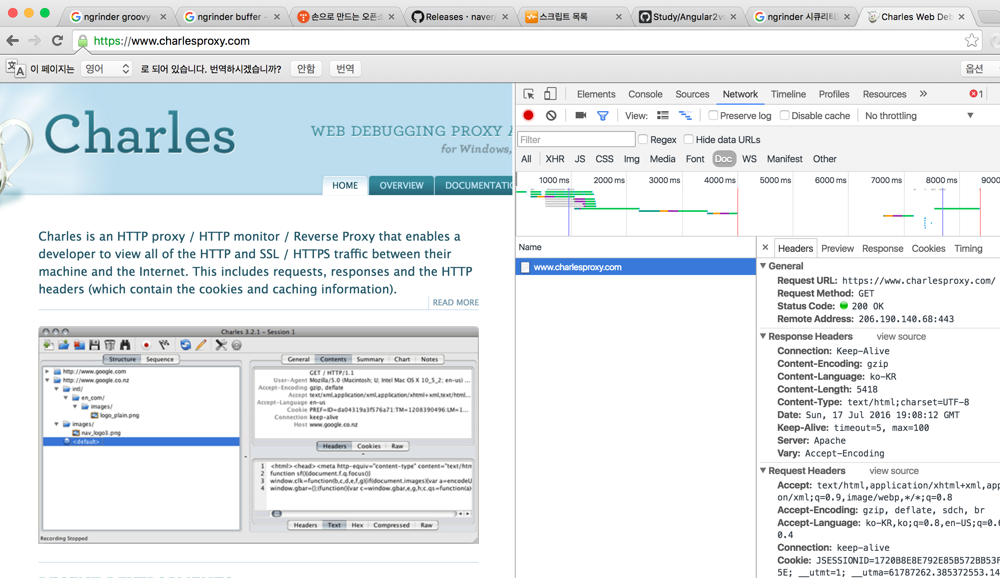

앱일 경우엔?

HAR(HTTP Archive format) file과 proxy를 이용하여 진행이 가능하다.


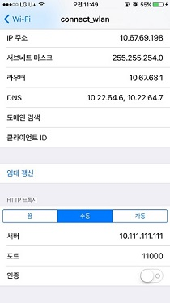

링크 : https://www.charlesproxy.com

## 오픈소스라 내 환경 이랑은 맞지 않아요.

  >nGrinder는 pf4j를 사용하여 사용자가 원하는 데로 plugin을 개발하여 사용 가능 합니다.

[개발방법](https://github.com/naver/ngrinder/wiki/How-to-develop-plugin-pf4j-in-kr)

  예)
  사용자 등록을 간단하게 해결해 주는 : SSO plugin
  과도한 사용량이 걱정될떄 사용하는 : network overflow plugin
  간단한 모니터링 : jvm monitor plugin

  >오픈소스라는 이점을 살려 나에게 필요한 plugin으로 추가 개발을 할수 있다는 점 GOOD~!


## 마치며

내가 만든 프로그램이 어느정도의 스트레스를 견디어 내는지 테스트 해보고 싶은 그런 생각이 든다면 오픈소스인 nGrinder.. 탐나지 않으신가요~
