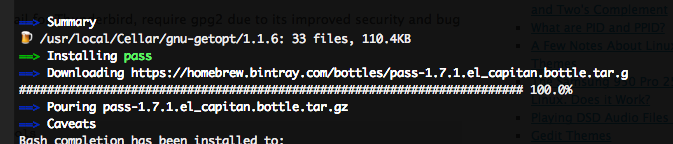
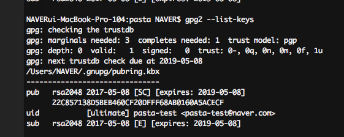
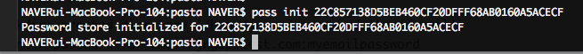
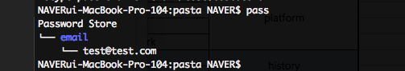
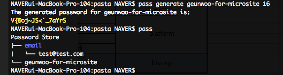
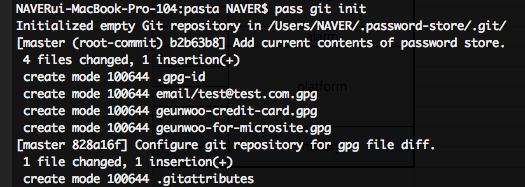
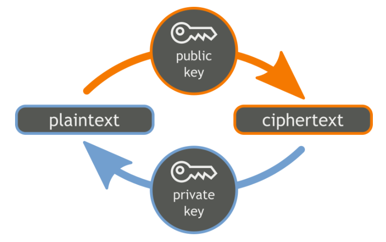

# Team public account password management

팀 프로젝트 내부에서 사용하는 부가 서비스의 계정들이 점차 늘어남에 따라 해당 계정들을 안전하게 공유하는 방법에 대해 소개합니다.

## pass 개념 및 사용준비

pass는 [GNU Privacy Guard (GnuPG or GPG)](https://en.wikipedia.org/wiki/GNU_Privacy_Guard) 기반의 패스워드 관리툴로 [PGP(Pretty Good Privacy)](https://en.wikipedia.org/wiki/Pretty_Good_Privacy)  오픈소스 구현판입니다. pass에서 사용된 암호화 방식의 대략적인 흐름도를 살펴보자면 아래와 같습니다.

보통 암호화를 하면 비밀번호가 생각나기 마련인데 이 암호화의 비밀번호는 암호화할때 쓰는 암호와 복호화할때 쓰는 암호가 같습니다. (이런 암호화 방식을 대칭키 암호화라 합니다.)

하지만 GPG에서 사용하는 [RSA](https://en.wikipedia.org/wiki/RSA_(cryptosystem) 방식은 다릅니다. RSA는 암호(이하 키)가 2개입니다. 어떤 키로 암호화하면 다른 키로만 복호화할 수 있습니다. 여기서 다른 사람에게 키를 공개해야 합니다. 왜나고요? 열쇠없이 자물쇠를 열 수는 없잖아요. 여기서 다른 사람에게 공개하는 키는 공개키(자물쇠)라 칭하고, 자신만이 가지는 키는 개인키(열쇠)라 칭합니다.

공개키로 암호화하면 개인키로만 복호화할 수 있습니다. 개인키로 암호화하면 공개키로만 복호화할 수 있습니다. 개인키는 오직 그 자신만이 가지고 있기에 개인키로 암호화 했다는 것은 개인이 직접 암호화 했다는 것을 의미합니다. 보는 사람은 공개키를 이용하여 복호화하면 됩니다.

그리고 보내는 사람이 받는 사람의 공개키로 암호화하면 개인키를 가지고 있는 받는 사람만이 복호화하여 볼 수 있습니다. 주로 자신의 메일을 암호화 하는 데 사용하며, 2015년 6월 기준으로 페이스북에서 이걸 이용해서 비밀번호 재설정 링크 같은 민감한 정보를 암호화해 보낸다 합니다.


### pass 설치

이제 사용을 해보기 위해 설치하는 방법을 따라가 보자. 필자는 환경이 Mac이므로 Mac 기준으로 진행함을 참고 바란다.

```
$ brew install pass
$ echo "source /usr/local/etc/bash_completion.d/password-store" >> ~/.bash_profile
```



### gpg key 생성

우선 무엇을 하든 키가 필요할테니 gpg key를 만들어 줍니다. gpg는 비대칭키 방식의 암호화를 사용할 수 있는 오픈 소스 툴입니다.

```
# 키 생성
$ gpg2 --gen-key

# 키 확인
$ gpg2 --list-keys
```



여기에서 gpg-id 는 22C857138D5BEB460CF20DFFF68AB0160A5ACECF 입니다.

### pass 활성화

gpg-id를 이용하여 pass를 활성화 시킵니다.

```
$ pass init 22C857138D5BEB460CF20DFFF68AB0160A5ACECF
```



gpg-id로 pass를 시작하면 pass는 앞으로 해당 gpg-id의 공개 키를 이용해서 모든 비밀번호를 암호화합니다. ‘~/.password-store/’ 디렉토리가 생성되었으며 이곳에 암호화된 비밀번호를 ‘.gpg’ 파일로 저장한다. 이제 pass를 이용해서 비밀번호를 관리할 수 있습니다.


## pass 사용하기

이제부터는 pass를 사용하는 방법에 대해서 알아보겠습니다.

### 비밀번호 저장

test@test.com 메일의 비밀번호를 저장하는 예입니다.

```
$ pass insert email/test@test.com

$ Enter password for email/test@test.com:
$ Retype password for email/test@test.com:
```



email 디렉토리 밑에 test@test.com 계정의 비밀번호가 저장되었으며, pass 명령으로 해당 계정을 호출하면 비밀번호가 출력됩니다.

```
$ pass email/test@test.com
pasta!@#

$ pass -c email/test@test.com
Copied email/test@test.com to clipboard. Will clear in 45 seconds.
```

비밀번호 이외에 여러줄의 텍스트 정보 입력시에는 ```-m```을 이용하면 됩니다.

```
$ pass insert -m geunwoo-credit-card

Enter contents of geunwoo-credit-card and press Ctrl+D when finished:

9291-1212-2323-4444
name: GEUNWOO SON
number: 1234-1232-1231-1233
cvv: 099

$ pass
Password Store
├── email
│   └── test@test.com
├── geunwoo-credit-card
└── geunwoo-for-microsite

$ pass geunwoo-credit-card
9291-1212-2323-4444
name: GEUNWOO SON
number: 1234-1232-1231-1233
cvv: 099
```

### 비밀번호 생성

새 계정을 만들때부터 pass를 이용하여 비밀번호 생성이 가능하다.



## git으로 pass 관리하기

이제 주 목적인 pass를 이용하여 git을 사용하는 방법을 알아보겠습니다.
 ‘~/.password-store/’ 를 git으로 관리하면 되겠지만 pass에서는 자체 명렁어를 제공합니다.

```
$ pass git init
Initialized empty Git repository in /Users/NAVER/.password-store/.git/
[master (root-commit) b2b63b8] Add current contents of password store.
 4 files changed, 1 insertion(+)
 create mode 100644 .gpg-id
 create mode 100644 email/test@test.com.gpg
 create mode 100644 geunwoo-credit-card.gpg
 create mode 100644 geunwoo-for-microsite.gpg
[master 828a16f] Configure git repository for gpg file diff.
 1 file changed, 1 insertion(+)
 create mode 100644 .gitattributes
```



일단 git과 연결되면, pass의 정보가 바뀔 때마다 커밋이 자동으로 이루어집니다. ```pass git push, pass git pull``` 등을 사용해서 업데이트 및 푸쉬를 합니다.


## 팀원과 공유하기

(출처: https://commons.wikimedia.org/wiki/File:Orange_blue_public_key_cryptography_en.svg)

pass는 여러 개의 gpg-id를 지원한다. 하나의 비밀번호를 여러 개의 공개 키로 동시에 암호화시킬 수 있다. 따라서 팀원 중 누군가가 새로운 비밀번호를 저장하면 pass는 팀원 전체의 공개 키들로 비밀번호를 암호화한다. 예를 들어 팀원이 10명이라면, 10개의 공개 키를 동시에 사용하여 새로 저장된 비밀번호를 암호화시킨다. 유의할 점은 서로 다른 공개 키로 암호화된 파일 10개가 따로 생기는 것이 아니라 10개의 공개 키를 한꺼번에 사용하여 암호화된 파일을 하나만 생성한다는 점이다. 저장한 비밀번호가 1개라면 팀원 수와는 상관없이 1개의 암호화된 파일만 생성된다. 이 암호화된 파일이 pass 디렉토리에 저장되며 git repository로 공유된다.

암호화시킬 때 사용했던 공개 키와 짝을 이루는 비밀 키 중에서 하나만 있으면 비밀번호는 복호화 가능하다. gpg 키를 생성할 때 저장된 비밀 키는 오직 키를 생성한 주인만 가질 수 있다. 따라서 10명의 팀원 각각은 팀원 모두의 공개 키(10개)와 자기 자신의 비밀 키(1개)를 가지고 있어야 한다. 팀원 모두의 공개 키로 비밀번호를 암호화시키고, 비밀번호를 복호화할 때는 자신의 비밀 키를 사용한다.

pass는 비밀번호를 암호화시키거나 복호화시킬 때 사용할 gpg-id를 ‘~/.password-store/.gpg-id’ 파일에 저장해둔다. 이 곳에 자신의 gpg-id가 없다면 그 팀원은 git repository를 복사할 수 있어도 비밀번호를 복호화시킬 수 없다. 즉, git repository가 해킹 당해도 gpg-id의 비밀 키를 모르면 저장된 비밀번호를 볼 수 없다.

따라서 팀 전체가 사용하는 pass 계정은 팀원 모두의 gpg-id를 알고 있어야 한다. 또한 모든 팀원은 각 gpg-id의 공개 키를 ‘~/.gnupg/’에 저장하고 있어야 한다. 단순히 git repository를 복사해서 공유하는 것만으로는 비밀번호를 암호화하거나 다시 복호화시킬 수 없다.

### 공개 키 공유하기

공개 키를 공유하는 방법에는 여러가지가 있지만, 키 서버를 사용하는 것이 가장 편합니다. 키 서버란 모든 사람들의 공개 키를 저장해둔 서버로 공개 키를 키 서버에 저장해두면, 특정 개인에게 암호화된 메세지를 보내고 싶을 때 서버에 저장된 키를 사용할 수 있으며 팀원 전체가 각자의 공개 키를 키 서버에 저장해두면 팀원 전체의 공유가 가능합니다.

키 서버에 공유하기 전에 공유할 키의 gpg-id를 확인한다. ```--list-secret-keys``` 옵션을 사용하면 현재 저장되어 있는 비밀 키를 볼 수 있습니다.

키서버로는 [MIT PGP Public Key Server](https://pgp.mit.edu/)를 활용하였습니다.

```
$ gpg2 --keyserver pgp.mit.edu --send-key 22C857138D5BEB460CF20DFFF68AB0160A5ACECF 80AC1D4A0503527C20885ECAE7CA659F6E2F49B0
gpg: sending key F68AB0160A5ACECF to hkp://pgp.mit.edu
gpg: sending key E7CA659F6E2F49B0 to hkp://pgp.mit.edu
```

모든 팀원은 자신의 gpg-id로 키를 키 서버에 공유해야 하며, 자신 외의 모든 팀원들의 키를 키 서버에서 공유받아야 합니다.

### 공개 키 가져오기

동료의 키를 ```--recv-key``` 옵션을 사용하여 가져옵니다.

```
$ gpg2 --keyserver pgp.mit.edu --recv-key CE7D1949
gpg: key 86C3CB05CE7D1949: public key "Oliver Erlenkämper (Privat) <oliver@erlenkaemper.de>" imported
gpg: Total number processed: 1
gpg:               imported: 1
```

가져온 키 확인은 ```gpg2 --list-keys``` 으로 가능 합니다.

```
$ gpg2 --list-keys
/Users/NAVER/.gnupg/pubring.kbx
-------------------------------
pub   rsa2048 2017-05-08 [SC] [expires: 2019-05-08]
      22C857138D5BEB460CF20DFFF68AB0160A5ACECF
uid           [ultimate] pasta-test <pasta-test@naver.com>
sub   rsa2048 2017-05-08 [E] [expires: 2019-05-08]

pub   rsa2048 2017-05-08 [SC] [expires: 2019-05-08]
      80AC1D4A0503527C20885ECAE7CA659F6E2F49B0
uid           [ultimate] pastatest pasta-test2 <pasta-test2@naver.com>
sub   rsa2048 2017-05-08 [E] [expires: 2019-05-08]

pub   rsa2048 2013-05-10 [SCA] [expires: 2018-05-09]
      A5E6F92540DD03C8ACF569D186C3CB05CE7D1949
uid           [ unknown] Oliver Erlenkämper (Privat) <oliver@erlenkaemper.de>
uid           [ unknown] Oliver Erlenkämper <oliver@erlenkaemper.de>
uid           [ unknown] Oliver Erlenkämper <o.erlenkaemper@googlemail.com>
uid           [ unknown] Oliver Erlenkämper <oerlenka@mail.uni-mannheim.de>
uid           [ unknown] Oliver Erlenkämper (Privat) <o.erlenkaemper@googlemail.com>
uid           [ unknown] Oliver Erlenkämper (Uni Mannheim) <erlenkaemper@uni-mannheim.de>
uid           [ unknown] Oliver Erlenkämper (Uni Mannheim) <erlenkaemper@uni-mannheim.de>
uid           [ unknown] Oliver Erlenkämper (trans-index.net) <erlenkaemper@trans-index.net>
uid           [ unknown] Oliver Erlenkämper (Uni Mannheim) <oliver.erlenkaemper@uni-mannheim.de>
uid           [ unknown] Oliver Erlenkämper (Uni Mannheim Student) <oerlenka@mail.uni-mannheim.de>
uid           [ unknown] Oliver Erlenkämper (Informatik Uni Mannheim) <erlenkaemper@informatik.uni-mannheim.de>
uid           [ unknown] Oliver Erlenkämper (Informatik Uni Mannheim) <erlenkaemper@informatik.uni-mannheim.de>
uid           [ unknown] Oliver Erlenkämper (Informatik Uni Mannheim) <oliver.erlenkaemper@informatik.uni-mannheim.de>
sub   rsa2048 2013-10-10 [E]
sub   dsa2048 2013-10-10 [S]
```

가져온 키의 신뢰수준을 변경해야 사용이 가능합니다.

```
$ gpg2 --edit-key 52FFE2BBCAB37AE64AD3999EC08C4ECD036C031E
gpg (GnuPG) 2.1.20; Copyright (C) 2017 Free Software Foundation, Inc.
This is free software: you are free to change and redistribute it.
There is NO WARRANTY, to the extent permitted by law.


pub  rsa2048/C08C4ECD036C031E
     created: 2013-04-08  expired: 2017-04-08  usage: SCEA
     trust: unknown       validity: expired
sub  rsa2048/C14FDB7E7CE774C4
     created: 2013-04-08  expired: 2017-04-08  usage: SEA
[ expired] (1). Travis Wolfrey <twolfrey@progress-index.com>

gpg> trust
pub  rsa2048/C08C4ECD036C031E
     created: 2013-04-08  expired: 2017-04-08  usage: SCEA
     trust: unknown       validity: expired
sub  rsa2048/C14FDB7E7CE774C4
     created: 2013-04-08  expired: 2017-04-08  usage: SEA
[ expired] (1). Travis Wolfrey <twolfrey@progress-index.com>

Please decide how far you trust this user to correctly verify other users' keys
(by looking at passports, checking fingerprints from different sources, etc.)

  1 = I don't know or won't say
  2 = I do NOT trust
  3 = I trust marginally
  4 = I trust fully
  5 = I trust ultimately
  m = back to the main menu

Your decision? 5
Do you really want to set this key to ultimate trust? (y/N) y

pub  rsa2048/C08C4ECD036C031E
     created: 2013-04-08  expired: 2017-04-08  usage: SCEA
     trust: ultimate      validity: expired
sub  rsa2048/C14FDB7E7CE774C4
     created: 2013-04-08  expired: 2017-04-08  usage: SEA
[ expired] (1). Travis Wolfrey <twolfrey@progress-index.com>
Please note that the shown key validity is not necessarily correct
unless you restart the program.

gpg> q
```

### 새로운 동료와 공유하기

새로운 팀원의 입장에서는 기존 팀원 중 누군가가 자신의 gpg-id를 pass에 포함시켜 주어야 합니다.

```
$ pass init BD699A08 D83EB3C5

Password store initialized for BD699A08, D83EB3C5

[master 0f2f059] Set GPG id to BD699A08, D83EB3C5.
 1 file changed, 1 insertion(+)

ci-tool: reencrypting to C7505C45A9CD6AD3 D4F57D4EE716C901
email/jngsp@test.com: reencrypting to C7505C45A9CD6AD3 D4F57D4EE716C901
heroku-for-microsite: reencrypting to C7505C45A9CD6AD3 D4F57D4EE716C901
corporate-credit-card: reencrypting to C7505C45A9CD6AD3 D4F57D4EE716C901

[master 40f16d2] Reencrypt password store using new GPG id BD699A08, D83EB3C5.
 4 files changed, 0 insertions(+), 0 deletions(-)
 rewrite ci-tool.gpg (100%)
 rewrite corporate-credit-card.gpg (100%)
 rewrite email/jngsp@test.com.gpg (100%)
 rewrite heroku-for-microsite.gpg (100%)
```

새로운 gpg-id를 추가하려면 기존에 포함되어 있는 gpg-id도 포함하여 pass를 다시 설정해주는 과정이 필요합니다.
위의 결과를 보면 기존에 저장되어 있던 비밀번호들이 새로운 공개 키를 이용해 다시 암호화 되는것을 확인 가능합니다.
변경된 내용은 git repository를 업데이트하여 공유하면 됩니다.

```
$ pass git push
```

이런다음 이제 새 동료는 git repository를 받아준후 사용이 가능합니다.

## 정리

pass를 이용하면 gpg 비밀번호를 편리하게 관리할수 있으며, 텍스트 형태의 정보는 무엇이든 저장이 가능하나,
모든 팀원들이 gpg 사용법 및 모든 팀원의 gpg-id와 비대칭키 암호화에 대한 사전학습이 필요한 단점이 존재하다.
또한 키의 유효기간이 경과되었을 경우에 대한 대비책도 추가로 필요해 보인다.


출처: http://boxnwhis.kr/2017/04/27/how_to_manage_passwords_for_your_team.html
